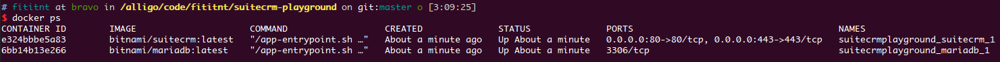

# SuiteCRM Rocha's playgrond
Rocha's playgrond for SuiteCRM (Open source Customer Relationship Management).

- Website: https://www.suitecrm.com/
- GitHub: https://github.com/salesagility/SuiteCRM
- [docker-compose.yml](docker-compose.yml) based on [vendor recommendation](https://github.com/bitnami/bitnami-docker-suitecrm)

----

<!-- screenshot here -->

## Logbook

```bash

# curl -sSL https://raw.githubusercontent.com/bitnami/bitnami-docker-suitecrm/master/docker-compose.yml > docker-compose.yml

# docker-compose up -d
docker-compose up # no -d to allow debug.

# Note:
#       See fullogs.sh
#       See https://github.com/bitnami/bitnami-docker-suitecrm/issues/24
#       I know how to hotfix this issue, but will focus on other issues before this one (fititnt, 2018-04-07 03:25)

# Open http://localhost on your browser

## Stop and clean all resources (DO NOT RUN `docker-compose down --volumes --rmi all` ON PRODUCTION)
docker-compose down --volumes --rmi all

```

See [fulllogs.sh](fulllogs.sh).

## Screenshots


.png)


## Environment

```
## Ubuntu 16.04.4 LTS
# Requires Need docker and docker-compose. Used:

$ docker -v
Docker version 17.12.1-ce, build 7390fc6

$ docker-compose -v
docker-compose version 1.18.0, build 8dd22a9
```
